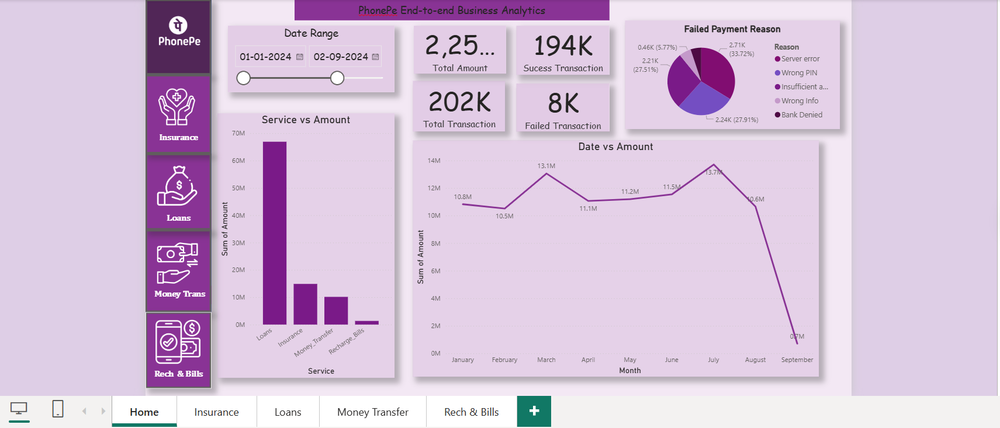

# 📱 PhonePe End-to-End Business Analytics Dashboard

---

## 🖼️ Dashboard Preview & Visual Gallery

| **Home (Overview)** | **Insurance Analytics** |
| :---: | :---: |
|  |  |

| **Loans & Credit** | **Money Transfers (UPI)** | **Recharge & Bills** |
| :---: | :---: | :---: |
|  |  |  |

---

## 🎯 Business Problem Statement

FinTech platforms process millions of daily transactions, making it challenging to monitor cross-product performance, track revenue flows, and identify transaction drop-offs in real time. 

Without centralized visibility, identifying specific friction points—such as recurring server errors, bank denials, or incorrect PIN entries—becomes difficult, leading to delayed decision-making, revenue loss, and user churn.

---

## 💡 Executive Summary & Solution

Designed and built an **End-to-End Interactive Business Analytics Dashboard in Power BI** to streamline multi-vertical financial monitoring across **Insurance**, **Loans**, **Money Transfers**, and **Utility Bills**. 

The dashboard enables stakeholders to perform **Root-Cause Analysis (RCA)** on failed transactions, track revenue trajectories across products, and evaluate user payment behavior across UPI and banking rails.

---

## 📊 Core Pages & Functional Highlights

### **1. Home (Overview Dashboard)**
* **Global KPI Tracking:** Tracks aggregate core business health metrics including Total Transaction Volume, Success Rates, and Total Failed Transactions.
* **Multi-Vertical Revenue Comparison:** Evaluates transaction distribution across product lines to identify core business drivers.
* **Failure Diagnostics:** Categorizes top transaction friction points (*Server Errors, Wrong PIN, Insufficient Funds, Bank Denials*).
* **Time-Series Analysis:** Measures monthly revenue trends across custom date ranges using interactive slicers.

### **2. Insurance Analytics**
* **Product Line Segmentation:** Analyzes premium collection across Bike, Car, Health, and Term Life insurance lines.
* **Failure Rate Profiling:** Isolates payment failures specific to recurring premium deductions.
* **Seasonality Tracking:** Tracks monthly premium variations to identify high-conversion periods.

### **3. Loans & Credit Metrics**
* **Portfolio Breakdown:** Segregates volume across Gold Loans, Auto Loans, Mutual Funds, and Credit Score checks.
* **Disbursement Analytics:** Monitors monthly loan disbursement patterns over time.
* **Risk & Drop-off Analysis:** Identifies primary payment blockers (e.g., Bank Denied, Server Timeout) during loan servicing.

### **4. Money Transfer (UPI P2P & P2M)**
* **Channel Distribution:** Compares transaction volume across *UPI ID*, *Self Account*, *QR Code*, and *Mobile Number* methods.
* **Volume vs. Velocity Tracking:** Evaluates average transfer amounts against transaction frequencies.
* **Rail Reliability:** Monitors real-time failure reasons for peer-to-peer transaction rails.

### **5. Recharge & Utility Bills**
* **Category Analysis:** Tracks consumer payments across Electricity, DTH, Mobile Recharge, and Broadband/Cable TV.
* **Recurring Billing Trends:** Measures monthly recurring billing patterns and volume drop-offs.
* **Completion Optimization:** Identifies specific errors occurring during automated bill payment processing.

---

## 🛠️ Technical Skillset & Tools Demonstrated

* **Data Visualization & Dashboard Design:** Custom UI/UX navigation, dynamic slicers, dynamic KPI cards, and multi-page data storytelling.
* **Data Modeling & Analytics:** Cross-filtering, business logic implementation, transaction failure rate modeling, and temporal trend analysis.
* **Business Acumen:** FinTech KPI tracking, Payment Gateway Root Cause Analysis (RCA), Revenue Drivers identification, and Customer Friction Optimization.
